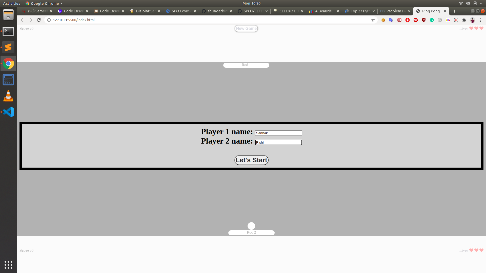
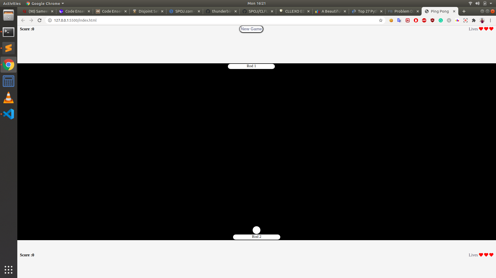
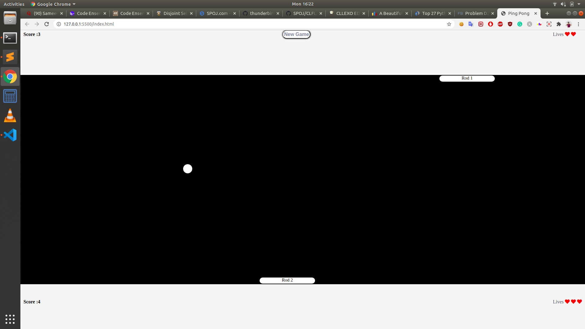
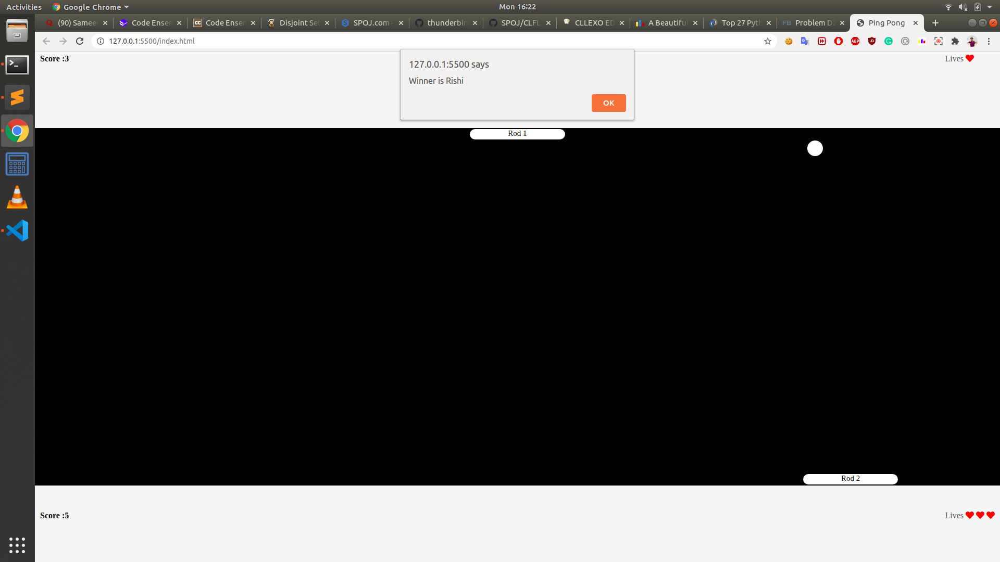

<h1 align = 'center'>Ping Pong Game</h1>

## About
This is a small javascript based two player ping pong game.

## How to use?
- `git clone git@github.com:sarthakeddy/Ping-Pong-Game.git`
- `cd Ping-Pong-Game/Game-TT/`
- Enter in the repo and run html file with Live Server.
- Game Begins.
- Enter the names of two players and start the game.
- Left and right arrow keys help in moving rod 1 of Player 1.
- 'A' and 'D' keys help in moving rod 2 of Player 2.

## Screens

## Get in touch

